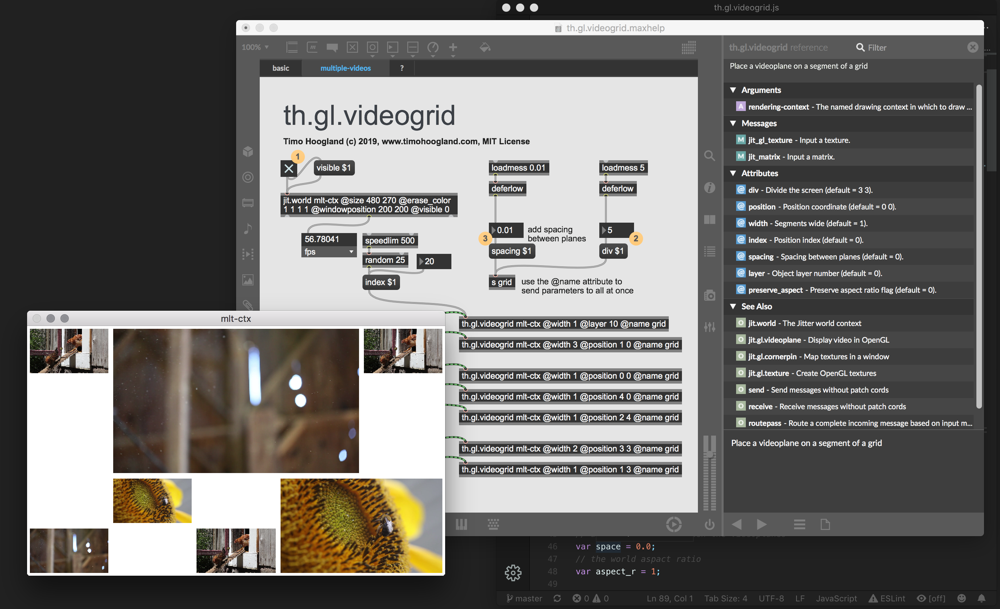

# th.gl.videogrid

**Please consider to download and donate via http://gumroad.com/tmhglnd**

**or become a patron on http://patreon.com/timohoogland**

---

Display a video/texture in the jit.world on a fixed grid.

## About

The th.gl.videogrid allows you to display a texture on a certain position in the screen. The entire screen is divided in a grid based on the x and y division values. The width of the video determines how many segments of the grid the video uses. The index determines the position of the video left>right top>bottom.  The position can also be set with x,y coordinates.

## Overview


## Install

Download zip
```
1. download zip
2. unzip and place in Max Searchpath (eg. MacOS ~/Documents/Max 8/Library)
3. restart Max8
```
Git clone
```
1. $ cd ~/Documents/Max\ 8/Library
2. $ git clone https://github.com/tmhglnd/th.gl.videogrid.git
3. restart Max8
```
```
4. Create a new object with "n" and type th.gl.videogrid. (Alt) + Right-click to open the helpfile.
5. Read the helpfile carefully
```
## License

The software is licensed under:
The MIT License
